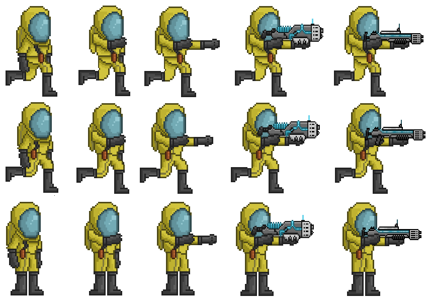

# 🌱 Projeto: Aventura Ambiental

Um jogo em desenvolvimento com o tema **Meio Ambiente**, onde o jogador veste um uniforme contra radiação e enfrenta um monstro feito de lixo em um cenário pós-apocalíptico.

---

## 🎮 Sobre o Projeto

- **Ferramentas Utilizadas:**  
  Desenvolvido usando **IntelliJ** com o gerador de projetos **GDX-liftoff**.

- **Status Atual:**  
  ✔️ Player e monstro adicionados  
  ✔️ Cenário implementado  
  ✔️ Movimentação do jogador funcional  
  ❌ Sistema de vida ainda não implementado  
  ❌ Armas e combate pendentes  
  ❌ Menu inicial e efeitos sonoros em desenvolvimento

- **Observações Importantes:**  
  > *Os assets utilizados não foram criados por mim. Foram baixados de fontes públicas e modificados para se encaixar na proposta do jogo.*

---

### 🛠️ Ferramentas utilizadas

As ferramentas utilizadas para o desenvolvimento foram:

- [IntelliJ IDEA](https://www.jetbrains.com/idea/): IDE para desenvolvimento em Java.
- [GDX-Liftoff](https://github.com/tommyettinger/gdx-liftoff): Gerador de projetos para o framework libGDX.

---

## 🧪 Próximos Passos

- Implementar armas do jogador (já possui os frames prontos)
- Criar sistema de vida e HUD (Já possui os frames prontos)
- Adicionar efeitos sonoros
- Criar tela de menu e pause
- Melhorar sprites dos personagens

---

## 🧍‍♂️ Personagem Principal

  
*Sprite sheet com os frames de movimentação e ações do jogador.*
